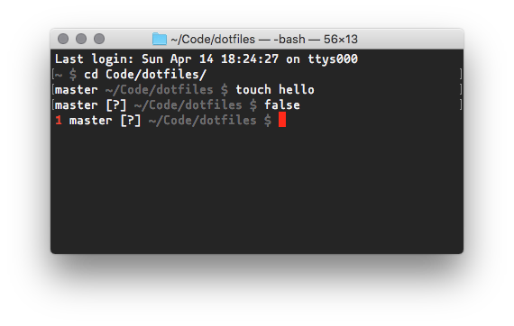

# dotfiles

Yes, everyone needs that nowadays. So, finally here’s mine, I know that the world was waiting.

And instead of simply basing this on some popular solutions (which undoubtably serve as inspiration), I just go for a minimal essence and add functions which I often use and also understand.

For macOS only, as that’s what I (currently, only, still) use.

# Features

- Less annoying tab-completion settings to keep me sane (do not fucking beep in case of ambiguous matches, but show those suggestions right away)

- Several useful aliasses, e.g.

  - `..` to `cd ..`
  - `...` to `cd ../..`, etc.
  - `-` to `cd -`
  - `dt` to `cd ~/Desktop`

- Minimalistic prompt (in its simplest incarnation just `~ $`), which adds the following information only when applicable

  - Red return code of last command when not successful
  - Git status (branch name, and symbols for uncommited, unstaged, untracked, stashed files/changes)
    

- Enable and set colors (optimized for dark theme)

- Visual Studio Code as default editor

- Git completion in Bash

- [Phoenix](https://github.com/kasper/phoenix) window manager configuration (still getting used to it)

- symlink `~/.ssh/config` to iCloud Drive -> `./sync/.ssh_config`

- auto-completion for SSH based on SSH config

# Installation

Run the following script to symlink the files in this repository at the proper locations:

```
$ ./install.sh
```

# Inspiration

- https://github.com/mathiasbynens/dotfiles
- https://github.com/jasonbarone/dotfiles
- https://github.com/eddiewebb/dotfiles
- https://github.com/lra/mackup
- https://code.tutsplus.com/tutorials/setting-up-a-mac-dev-machine-from-zero-to-hero-with-dotfiles--net-35449
- http://blog.taylormcgann.com/2012/06/13/customize-your-shell-command-prompt/

---

Copyright (c) Philipp Katz
